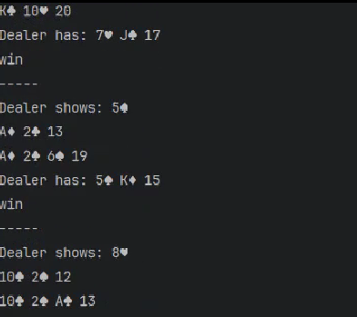

## Blackjack AI

This project uses Qlearning to implement a Blackjack game AI. The goal is to train an agent to play the game autonomously and achieve the highest score possible.

### Training the Agent

To train the agent, run the `train.py` script:
```bash
python train.py
```
This will start the training process, and you can see the agent playing the game and improving over time. The current score and the record score will be printed in the console. The model weights will be saved every time a new record is achieved.

### Playing with the Trained Model

To play the game using the trained model, run the `blackjack_agent.py` script:

```bash
python blackjack_agent.py
```

This will load the saved model weights and start the game. The agent will play the game autonomously, and the final score will be printed in the console.

### Project Structure


* `blackjack_env.py`: contains the implementation of the Blackjack game.
* `model.py`: contains the implementation of the neural network model and the **Trainer class**.
* `train.py`: script to train the agent.
* `blackjack_agent.py`: script to play the game using the trained model.

### Blackjack AI
