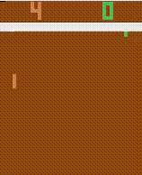

## Atari A2C Training with Stable Baselines3

This project aims to provide an efficient Python script for training an A2C (Advantage Actor-Critic) model using the Stable Baselines3 library on the classic Atari Pong environment. The script is designed to support various functionalities such as loading pre-trained weights, continuing learning from pre-trained weights, and specifying the total timesteps for training.

### Requirements

Ensure you have the following dependencies installed:

- `torch==2.2.2`
- `torchvision==0.17.2`
- `stable-baselines3[extra]`

You can quickly install the required dependencies via pip:

```bash
pip install -r requirements.txt
```

### Usage
You can run the training script using the following command:

```bash
python train_a2c.py [options]
```

### Options

- --load PATH: Specifies the path to pre-trained weights. If provided, the script will load the weights from the given path.
- --continue_training: Enables continuing learning after loading weights. This option is only effective when used along with --load.
- --total_timesteps STEPS: Specifies the total timesteps for training. Default is 100,000.

### Example Usage
To train the model from scratch:

```bash
python train_a2c.py
```

To load pre-trained weights and continue learning for an additional 500,000 timesteps:

```bash
python train_a2c.py --load <path_to_pretrained_weights> --continue_training --total_timesteps 500000
```

### File Structure

- `train_a2c.py`: Main Python script for training the A2C model.
- `model/`: Directory to save trained model weights.
- `play_pong_using_model.py`: A script to utilize the pre-trained model to play the game.

### pong_ai
